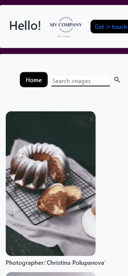

# Galeria de fotos

Esse projeto foi realizado com o intuito de colocar em prática algumas técnologias e conceitos que tenho 
  estudado, como POO, Bootstrap, HTML semântico, entre outros

  
 

### Features

- [X] Galeria com páginação.
- [X] Bootstrap responsivo.
- [X] Campo de search para imagens.
- [X] Fotos carregadas da API disponibilizada pelo site Pexels.
 
 

<h1 align="center">
  
  
</h1>

 

## 💻 Tecnologias utilizadas
  

  
  
  
  
  

  
   

  
  Feito com ❤️ por /MateusGCS - [Meu Linkedin](https://www.linkedin.com/in/mateusgcs/) 
